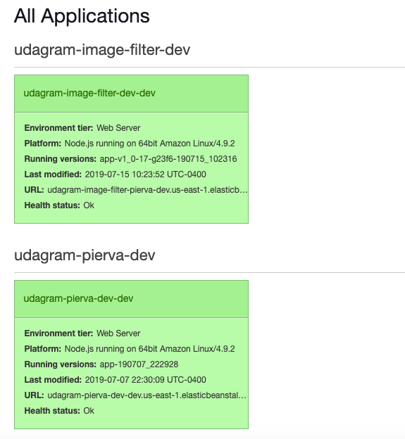

# Udagram Image Filtering Microservice

This API makes use of nodejs to read an image from an URL and then passes it to python with a sub process. Python then filters the image, finds the edges with OpenCV and returns an absolute path to the image to Nodejs.

The processed image, will then be sent as response to the user. Once the image is received by the user, all the temporary working files, will be deleted from the server.

## Table of contents
+ [Get started](#get-started)
  * [Setup Python3 environment](#setup-python3-environment)
  * [Install Python dependencies](#install-python-dependencies)
  * [Setup Node environment](#setup-node-environment)
+ [Available endpoints](#availabe-endpoints)
  * [Endpoint examples](#endpoint-examples)
+ [Deploying your system](#deploying-your-system)


## Get started
This microservice makes use of Nodejs to process requests and responses, and python3 to process the image.

### Setup Python3 environment
It is recommended to create a virtual environment for the project.

If you don't have the python3 package, run the following command.
```sh
$ sudo apt-get install python3-venv
```

Navigate into your project folder and create a new enviornment.
```sh
$ sudo python3 -m venv env
```

`env` is the name of the environment. You can give any name you like.

Activate the new environment.

```sh
$ source <path-to-enviornment>/bin/activate

# Considering the environment is called env the command will be
$ source env/bin/activate
```

### Install Python dependencies
This service needs two dependencies in order to work
1. OpenCV
2. numpy (required by OpenCV)

Type the following command to install the two libraries.
```sh
$ pip3 install -r requirements.txt
```

### Setup Node environment

In order to use this service, it is necessary to have Nodejs v10.16 (or grater) installed on the machine.

Open a new terminal within the project directory and run:

1. Initialize a new project: `npm i`
2. run the development server with `npm run dev`

## Available endpoints

This micro service has two endpoints:
1. '/'
2. '/filteredimage

The first endpoint sends a short message to the user with some tips on how to use the service.

The second endpoint is the important one. It accepts the following query parameters:

```
image_url [required]
lower [optional - upper parameter must be provided]
upper [optional - lower parameter must be provided]
```

The first parameter, `image_url`, is mandatory, and is a full URI that points to an image.
We'll make use of the Jimp library to check whether the url points to a valid image or not.

`lower` and `upper` are optional parameters and must be used jointly. These two parameters specify the lower and upper threshold limits for the OpenCV Canny function used to find the image edges.

If lower and upper are not specified, python will use a method to auto detect the best thresholds.

### Endpoint examples

Endpoint example without thresholds:
```
http://localhost:8082/filteredimage?image_url=https://images.unsplash.com/photo-1529940340007-8ef64abc360a?ixlib=rb-1.2.1&ixid=eyJhcHBfaWQiOjEyMDd9&auto=format&fit=crop&w=753&q=80
```

Endpoint example with thresholds:
```
http://localhost:8082/filteredimage?image_url=https://images.unsplash.com/photo-1529940340007-8ef64abc360a?ixlib=rb-1.2.1&ixid=eyJhcHBfaWQiOjEyMDd9&auto=format&fit=crop&w=753&q=80&lower=50&upper=200
```

## Deploying your system

The deploy to elasticbeanstalk run the following command in the root of your project:
```sh
$ eb init
```
You need to answer few questions in order to initialize the elasticbean environment and create the configuration file (config.yml).

Now we can create the environment in aws with:
```sh
$ eb create
```

Update the `config.yml` file in order to use the artifact for the deployment. Add the below section under the master key:

```yml
deploy:
  artifact: ./www/Archive.zip
```

The first part of `config.yml` should now look like this:

```yml
branch-defaults:
  master:
    environment: null
    group_suffix: null
deploy:
  artifact: ./www/Archive.zip
```

Basically we are telling elasticbean to use `Archive.zip` for the deployment.

Run this command, to actually create the archive:
```sh
$ npm run build
```

Deploy your code with this command:
```sh
$ eb deploy
```

If there isn't any default environment setup, you need to specify the environment name:

```sh
$ eb deploy <your-environment-name>
```

You can check the environment name in the aws elasticbeanstalk console.

At the end of the deployment, if everything is working correctly you should see a green instance similar to the below screenshot:


